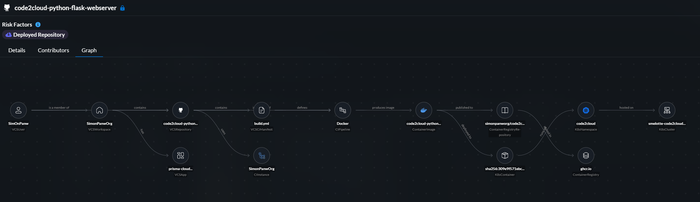
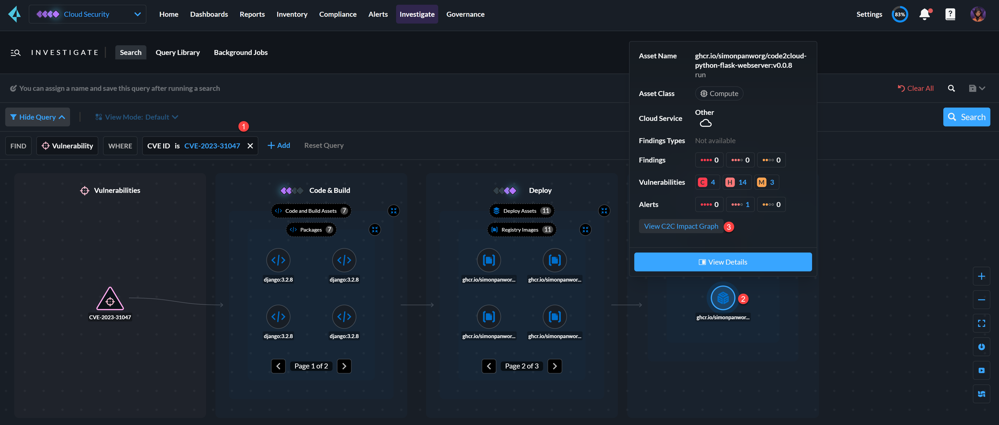
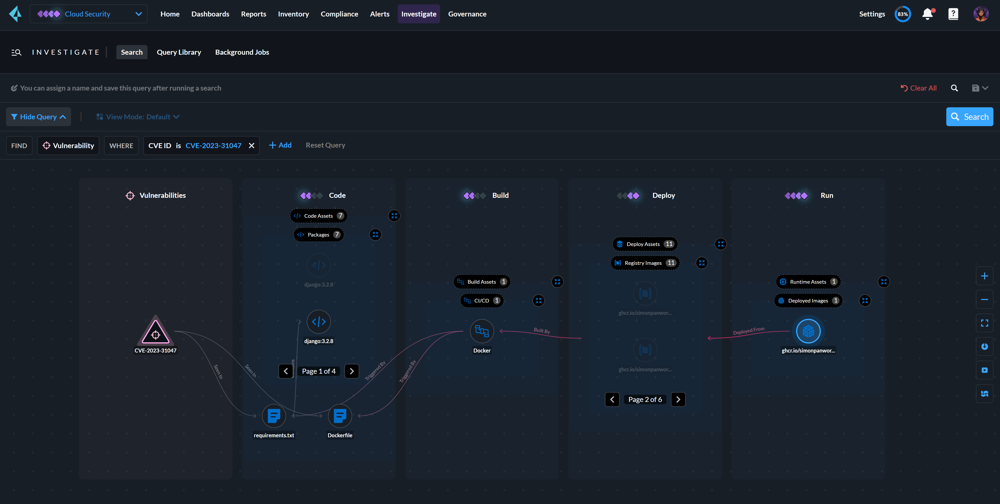

# Code2Cloud Python Flask Application

## Description

This repository contains a Python Flask application designed to demonstrate the code-to-cloud traceability feature of Prisma Cloud. The application allows users to manage customer data, showcasing CRUD (Create, Read, Update, Delete) operations, and is containerized for deployment on cloud platforms like AKS, EKS, or GKE. The pipeline utilizes GitHub Actions for CI/CD, building and pushing the Docker image to GitHub Container Registry (GHCR).  

## Illustrations

Code2Cloud traceability is a GA feature and available now. 
#### Code2Cloud Traceability



#### Code2Cloud Impact Graph (BETA)
The impact graph is a **BETA** feature and requires a feature flag to be enabled.  
The steps to access it are as follows:
1. Go to the Investigate tab.
2. Search for a vulnerability with CVE ID: CVE-2023-3104.
3. Click on the runtime container image.
4. Click "View C2C Impact Graph".

#### Code2Cloud Investigate


#### Code2Cloud Impact Graph


## Goals

- Demonstrate code-to-cloud traceability using Prisma Cloud.
- Showcase a simple customer management system with CRUD operations.
- Utilize GitHub Actions for automated CI/CD.
- Deploy the application using Kubernetes manifests.  


## Features

- Add, edit, delete, and list customers.
- Flask-based web application.
- SQLite database for data storage.
- CI/CD pipeline using GitHub Actions.
- Containerized application deployed on Kubernetes.

## Prerequisites
Before you begin, ensure you have the following:  

- **System Admin Access to Prisma Cloud:** You need administrative access to Prisma Cloud to configure and monitor the security settings and ensure proper integration with your Kubernetes cluster.  

- **Kubeadmin Access to AKS, EKS, or GKE:** Ensure you have Kubernetes admin access to your chosen cloud provider's Kubernetes service (Azure Kubernetes Service, Amazon Elastic Kubernetes Service  

- **Prisma Cloud Defender Agent Deployed on K8s Cluster:** The Prisma Cloud Defender agent should be deployed on your Kubernetes cluster and connected to the Prisma Cloud tenant. This ensures that Prisma Cloud can monitor and protect your deployed applications.

## Step-by-Step Procedure  

### Fork this Repository

Click the "Fork" button in the top-right corner to create your own copy of the repository.  

### Onboard the Forked Repository in Prisma Cloud

Follow the instructions in the Prisma Cloud documentation to connect your GitHub repository:  
[Add GitHub Repository to Prisma Cloud](https://docs.prismacloud.io/en/classic/appsec-admin-guide/get-started/connect-your-repositories/code-repositories/add-github)

### Clone the repo

Clone your forked repository to your local machine:
```bash
git clone https://github.com/<your-github-username>/code2cloud-python-flask-webserver.git
```

### Change the Version Number
Change the directory to the cloned repository:

```console
cd code2cloud-python-flask-webserver
```

Open the `version.py` file and update the version number:
```python
version = "0.0.10"  # Update to a new version number
```

Open the `manifests/deployment.yaml` file and update the version number:
```yaml
image: ghcr.io/simonpanworg/code2cloud-python-flask-webserver:v0.0.10  # Update to a new version number
```

### Push the changes to the Repository

```bash
git add version.py
git commit -m "Update version number to 0.0.10"
git push origin main
```

### Create a PAT (Personal Access Token) Token
- Go to your GitHub account settings.
- Navigate to "Developer settings" and then "Personal access tokens."
- Generate a new token with write:packages scope and save it securely.

### Deploy the Application with Manifests Files
Apply the Kubernetes manifests to create the namespace, deployment, and service:
```bash
kubectl apply -f manifests/deployment.yaml
```

### Create a Secret in the K8s Cluster to Pull the Image from GHCR  

Use the PAT token to create a Docker registry secret:
```bash
kubectl create secret docker-registry ghcr-io-creds \
--docker-server=ghcr.io \
--docker-username=<your-github-username> \
--docker-password=<your_pat_token> \
--docker-email=<your-github-email>
```

### Verify the Deployment
Check the status of the pods to ensure they are running:
```bash
kubectl get pods -n code2cloud
```

Verify the service is created and accessible:
```bash
kubectl get svc -n code2cloud
```

### Access the Application
Use the external IP provided by the LoadBalancer service to access the application in your browser.  

## Conclusion
By following these steps, you have successfully demonstrated the code-to-cloud traceability feature of Prisma Cloud using a Python Flask application. The application is now deployed on a Kubernetes cluster, showcasing automated CI/CD with GitHub Actions and Docker.  